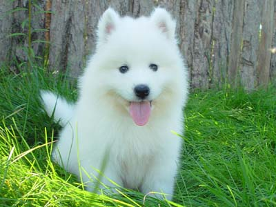

# 一级标题
## 二级标题

* **most popular** markup languages.
* which words and phrases should look different.
* file displayed in the Atom text editor.

1. &#160;&#160;&#160;&#160;&#160;&#160;communicate with each other.
2. &#160;&#160;&#160;&#160;&#160;&#160;Researchers or students some extended syntax is different.
3. &#160;&#160;&#160;&#160;&#160;&#160;Job seekers. Used to create a resume. 
----------------------------------------------------------------------------------------------------------------------------------
####  Makedown grammer
| A | B | C
|----------------:|-----------------:|--------:|
| *Italics* | i1 | i2 |
| **bold** | b1 | b2 |
| D | E | F |
| H | J | Q |


----------------------------------------------------------------------------------------------------------------------------------
### A code block
 
```
#include<stdio.h>
int main()
{
    printf("welcome!\n");
    return 0;
}
```  

----------------------------------------------------------------------------------------------------------------------------------

>a quote


### *斜体*  

### **粗体**
## 
## 

##  [link](xyxy.md)

